# SISOP-1-2026-IT-063

## Dewa Ngakan Gede Wira Adhimukti (5027251063)

## SOAL 1 - ARGO NGAWI JESGEJES

Pada soal 1 diminta untuk mencari dan menampilkan:
1. Jumlah seluruh penyumpang
2. Jumlah gerbong yang beroperasi
3. Siapa dan berapa umur penumpang tertua
4. Rata - rata usia penumpang (dibulatkan)
5. Jumlah penumpang business class


Nantinya akan terdapat 2 file pada soal 1, yakni `KANJ.sh` dan      `passenger.csv`


Contoh format input nantinya yaitu:
```sh
awk -f KANJ.sh passenger.csv a/b/c/d/e
```

Adapun penyelesaian dari soal 1 yakni sebagai berikut:
- Pertama, download dulu file csv melalui link yang disediakan di soal dan simpan dengan nama  `passenger.csv`
```bash
wgets "passenger.csv" "https://docs.google.com/spreadsheets/d/1NHmyS6wRO7To7ta-NLOOLHkPS6valvNaX7tawsv1zfE/export?format=csv&gid=0"
```

- Dengan melihat isi file `passenger.csv`, kita dapat mengetahui bahwa isi file adalah:
    - Kolom 1: nama penumpang
    - Kolom 2: usia
    - Kolom 3: kursi kelas
    - Kolom 4: gerbong
- Penyelesaian soal 1
```bash
#!/bin/bash

BEGIN {
	FS =  ","
	input = ARGV[2]
	delete ARGV[2]
}	

NR > 1 {
	if (input == "a") count++
	else if(input == "b") gerbong[$4]++
	else if(input == "c") {
		if ($2 > oldest) {oldest = $2; name = $1}
	} 
	else if(input == "d" ) {count++; total+=$2}
	else if(input == "e") {
		if ($3 == "Business") {count_class++}
	}  
} END {
	if (input == "a") print "Jumlah seluruh penumpang KANJ adalah" ,count, "orang"
	else if (input =="b") print "Jumlah gerbong penumpang KANJ adalah" ,length(gerbong)
	else if(input =="c") print name, "adalah penumpang tertua dengan usia", oldest, "tahun"
	else if (input == "d") print "Rata-rata usia penumpang adalah" ,int(total/count), "tahun"
	else if(input == "e") print "Jumlah penumpang business class ada" ,count_class, "orang"
	else print "Soal tidak dikenali. Gunakan a, b ,c ,d, atau e."
}
```
- Di bagian `BEGIN` , ditulis dulu `Field Separator` untuk data pada file `passenger.csv` yakni berupa koma.
- Berdasarkan format input yang sudah disebutkan sebelumnya, dapat diektahui bahwa kode nanti akan menjalanlan program pada `KANJ.sh`, membuka file `passenger.csv`, dan menerima suatu argumen berupa a/b/c/d/e. Argumen tersebut akan disimpan dalam variabel `input` di dalam program `KANJ.sh`.
- Program akan mencari data dengan melewati header, oleh karena itu `NR>1`
1. Mencari dan menampilkan jumlah penumpang (input = a)
```bash
if (input == "a") count++
...
if (input == "a") print "Jumlah seluruh penumpang KANJ adalah" ,count, "orang"
```
2. Mencari dan menampilkan jumlah gerbong yang beroperasi (input = b)
```bash
else if(input == "b") gerbong[$4]++
...
else if (input =="b") print "Jumlah gerbong penumpang KANJ adalah" ,length(gerbong)
```
3. Mencari dan menampilkan siapa dan berapa umur penumpang tertua (input = c)
```bash
else if(input == "c") {
		if ($2 > oldest) {oldest = $2; name = $1}
	}
...
else if(input =="c") print name, "adalah penumpang tertua dengan usia", oldest, "tahun"
```

4. Mencari rata - rata usia penumpang (input = d)
```bash
else if(input == "d" ) {count++; total+=$2}
...
else if (input == "d") print "Rata-rata usia penumpang adalah" ,int(total/count), "tahun"
```

5. Mencari jumlah penumpang business class (input = e)
```bash
else if(input == "e") {
		if ($3 == "Business") {count_class++}
	}  
...
else if(input == "e") print "Jumlah penumpang business class ada" ,count_class, "orang"
```

6. Jika input tidak berupa a/b/c/d/e
```bash
else {
    print "Soal tidak dikenali. Gunakan a, b ,c ,d, atau e."
    print "Contoh format: awk -f KANJ.sh passenger.csv a"
}
```

Berikut adalah screenshot jawaban dari soal 1
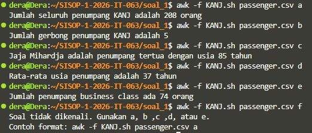


## SOAL 2 -  EKSPEDISI PESUGIHAN GUNUNG KAWI - MAS AMBA

Pada soal ini, pertama-tama kita diminta untuk mengunduh file `peta-ekspedisi-amba.pdf` menggunakan `gdown`

```sh
gdown "peta-ekspedisi-amba.pdf" "https://drive.google.com/uc?id=1q10pHSC3KFfvEiCN3V6PTroPR7YGHF6Q"
```

Setelah file pdf tersebut diunduh, file dibuka menggunakan `cat` untuk melihat isi filenya.

```sh
cat peta-ekspedisi-amba.pdf
```

Pada bagian bawah dari hasil `cat`, nantinya akan ditemukan link menuju repo GitHub.

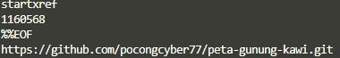

Selanjutnya, file tersebut perlu di-clone ke dalam penyimpanan local.
```
git clone https://github.com/
pocongcyber77/peta-gunung-kawi.git
```

Setelah repo tersebut di-clone, akan didapat folder bernama `peta-gunung-kawi`. Folder tersebut berisi 1 file bernama `gsxtrack.json`. Berikut adalah isi dari file `gsxtrack.json` tersebut:

```bash
{
"type": "FeatureCollection",
"name": "gunung_kawi_spatial_nodes",
"dataset_info": {
"crs": "EPSG:4326",
"datum": "WGS84",
"region": "Gunung Kawi, East Java, Indonesia",
"edge_distance_m": 2000,
"generated_at": "2026-03-13T10:02:00Z"
},
"features": [
{   
"type": "Feature",
"id": "node_001",
"properties": {
"site_name": "Titik Berak Paman Mas Mba",
"node_class": "primary_reference_point",
"latitude": -7.920000,
"longitude": 112.450000,
"elevation_m": 254,
"status": "active"
},
"geometry": {
"type": "Point",
"coordinates": [112.450000, -7.920000]
}
},
{
"type": "Feature",
"id": "node_002",
"properties": {
"site_name": "Basecamp Mas Fuad",
"node_class": "field_operations_base",
"latitude": -7.920000,
"longitude": 112.468100,
"elevation_m": 261,
"status": "active"
},
"geometry": {
"type": "Point",
"coordinates": [112.468100, -7.920000]
}
},
{
"type": "Feature",
"id": "node_003",
"properties": {
"site_name": "Gerbang Dimensi Keputih",
"node_class": "anomaly_site",
"latitude": -7.937960,
"longitude": 112.468100,
"elevation_m": 248,
"status": "restricted"
},
"geometry": {
"type": "Point",
"coordinates": [112.468100, -7.937960]
}
},
{
"type": "Feature",
"id": "node_004",
"properties": {
"site_name": "Tembok Ratapan Keputih",
"node_class": "boundary_marker",
"latitude": -7.937960,
"longitude": 112.450000,
"elevation_m": 246,
"status": "inactive"
},
"geometry": {
"type": "Point",
"coordinates": [112.450000, -7.937960]
}
}
]
}

```
Soal lalu meminta untuk membuat shell script dengan nama `parserkoordinat.sh` untuk mengambil beberapa titik lokasi yang ada pada file `gsxtrack.json`. Nantinya, hasil akan disusun dengan format `id, site_nama, latitude, langitude` lalu disimpan ke dalam file `titik-penting.txt`. Berikut adalah isi dari file `paserkoordinat.sh` yang digunakan utnuk mengambil titik - titik lokasi pada file `gsxtrack.json`:

```bash
#!/bin/bash

awk '
/"id":/ { match($0, /"id": "([^"]+)"/, arr); id = arr[1] }
/"site_name":/ { match($0, /"site_name": "([^"]+)"/, arr); site = arr[1] }
/"latitude":/ { match($0, /"latitude": ([^,]+)/, arr); lat = arr[1] }
/"longitude":/ { match($0, /"longitude": ([^,]+)/, arr); lon = arr[1] }

/"status":/ {
    print id","site","lat","lon
    id = ""; site = ""; lat = ""; lon = ""
}
' gsxtrack.json > titik-penting.txt
```

Setelah program di atas dijalankan, akan terdapat total 4 titik lokasi yang berhasil diambil dan disimpan pada file `titik-lokasi.txt`, yakni:

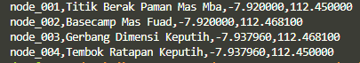

Selanjutnya, soal meminta untuk membuat program shell bernama `nemupusaka.sh` untuk mencari titik pusat menggunakan metode titik simetri diagonal berdasarkan titik koordinat yang sudah ditemukan tadi. Hasil dari koordinat titik pusat tersebut akan disimpan di dalam suatu file bernama `posisipusaka.txt` Berikut adalah isi dari program `nemupusaka.sh` :
```sh
#!/bin/bash

awk -F, '
{count++
x_total += $3
y_total += $4 }
END { 
x = x_total/count
y = y_total/count
print "Koordinat pusat:"
print x, y}' titik-penting.txt > posisipusaka.txt 2>/dev/null
```
Adapun hasil dan jawaban dari koordinat pusat tersebut adalah:

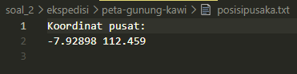


## SOAL 3 - KOS SLEBEW AMBATUKAM

Pada soal 3, soal meminta untuk membuat suatu sistem informasi manajemen kos yang menu utamanya berisi:

1. Tambah Penghuni Baru
2. Hapus Penghuni
3. Tampilkan Daftar Penghuni
4. Update Status Penghuni
5. Cetak Laporan Keuangan
6. Kelola Cron (Pengingat Tagihan)
7. Keluar

Berikut adalah kode dan tampilan dari menu utama pada sistem:

```bash

menu(){
        cat << 'EOF'                  
 _ __ ___  ___  ___   ___  _    ___  ___  ___  _ _ _  
| / /| . |/ __>|_ _| / __>| |  | __>| . >| __>| | | | 
|  \ | | |\__ \ | |  \__ \| |_ | _> | . \| _> | | | | 
|_\_\`___'<___/ |_|  <___/|___||___>|___/|___>|__/_/  
                                                                               
EOF
    echo "===================================================="
    echo "            SISTEM MANAJEMEN KOST SELEBEW"
    echo "===================================================="
    echo " ID | MENU"
    echo "----+----------------------------------------------"
    echo " 1  | Tambah Penghuni Baru"
    echo " 2  | Hapus Penghuni"
    echo " 3  | Tampilkan Daftar Penghuni"
    echo " 4  | Update Status Penghuni"
    echo " 5  | Cetak Laporan Keuangan"
    echo " 6  | Kelola Cron (Pengingat Tagihan)"
    echo " 7  | Exit Program"
    echo "===================================================="
}


while true; do
    clear
    cron_default
    menu
    read -p "Masukkan opsi [1-7]: " choice
    case $choice in
    1) 
        clear
        tambah_penghuni 
        ;;
    2)
        clear
        hapus_penghuni
        ;;
    3)
        clear
        tampilkan_penghuni
        ;;
    4) 
        clear
        update_status
        ;;
    5)
        clear
        cetak_laporan
        ;;
    6)
        clear
        cron_dashboard
        ;;
    7)  
        echo "KELUAR DARI SISTEM MANAJEMEN KOST SLEBEW"
        exit
        ;;
    *)
        echo "Opsi tidak valid! Silakan masukkan angka [1-7]"
        read -p "Tekan [ENTER] untuk melanjutkan..."
        ;;
    esac
done
```


Jika angka di luar opsi dimasukkan, maka program akan memunculkan pesan sebagai berikut:

 


 ### Menu 1 - Tambah Penghuni Baru
 Pada menu ini, program akan menambahkan data penghuni baru ke database `penghuni.csv` pada folder `data`. Program akan meminta input berupa nama, nomor kamar yang akan ditempati, harga sewa per bulan, tanggal masuk ke kos, dan status awal saat masuk ke kos (aktif/menunggak). Beberapa validasi yang digunakan pada menu ini yaitu:
 - Nama harus berupa huruf, tidak boleh berisi angka dan atau karakter khusus.
 - Nomor kamar yang akan dimasukkan haruslah kosong dan tidak ditempati oleh penghuni lain
 - Harga sewa tidak boleh negatif
 - Format tanggal masuk harus YYYY-MM-DD
 - Status awal hanya bisa "Aktif/Menunggak"

 Berikut adalah kode yang diterapkan untuk Menu 1:
 ```bash
tambah_penghuni(){
    echo "======================================"
    echo "   Menambahkan Data Penghuni Baru"
    echo "======================================"
    
    file="data/penghuni.csv"

    mkdir -p data

    if [ ! -s "$file" ]; then
        printf "id,nama,kamar,harga_sewa,tanggal_masuk,status\n" > "$file"
    fi 

    #nama
    while true; do
        read -p "Masukkan Nama: " nama

        if [[ ! "$nama" =~ ^[A-Za-z\ ]+$ ]]; then
            echo "Nama hanya boleh huruf dan spasi!"
        else
            break
        fi
    done
    
    #nomor kamar
    while true; do
        read -p "Masukkan Nomor Kamar: " kamar
        if ! [[ "$kamar" =~ ^[0-9]+$ ]]; then
            echo "Nomor kamar harus berupa angka!"
            continue
        fi

        if [ "$kamar" -le 0 ]; then
            echo "Nomor kamar harus lebih dari 0!"
            continue
        fi

        if awk -F',' -v k="$kamar" 'NR>1 && $3==k {found=1} END{exit !found}' "$file"; then
            echo "Kamar sudah terisi! Pilih nomor lain."
        else
            break
        fi
    done

    #harga
    while true; do
        read -p "Masukkan Harga Sewa: " harga_sewa

        if ! [[ "$harga_sewa" =~ ^-?[0-9]+$ ]]; then
            echo "Harus angka!"
            continue
        fi

        if [ "$harga_sewa" -le 0 ]; then
            echo "Harga harus lebih dari 0!"
        else
            break
        fi
        
    done  

    #tanggal
    while true
    do 
        read -p "Masukkan Tanggal Masuk (YYYY-MM-DD): " tanggal_masuk
        # cek format
        [[ "$tanggal_masuk" =~ ^[0-9]{4}-[0-9]{2}-[0-9]{2}$ ]] || {
            echo "Format tanggal tidak valid"
            continue
        }

        # cek apakah tanggal valid 
        tanggal_num=$(date -d "$tanggal_masuk" +%Y%m%d 2>/dev/null) || {
            echo "Tanggal tidak valid"
            continue
        }

        today_num=$(date +%Y%m%d)

        # cek apakah tanggal di masa depan
        if (( tanggal_num > today_num )); then
            echo "Tanggal tidak boleh melebihi hari ini"
            continue
        fi

        break
    done
    
    #status awal
    while true
    do
        read -p "Masukkan Status Awal (Aktif/Menunggak): " status_awal
        if [[ $status_awal == "Aktif" || $status_awal == "Menunggak" ]]; then
            break
        else
            echo 'Format tidak valid! Silakan tulis "Aktif" atau "Menunggak"'
        fi
    done

    #simpan
    last_id=$(tail -n 1 "$file" | cut -d',' -f1)

    if [[ "$last_id" =~ ^[0-9]+$ ]]; then
        new_id=$((last_id + 1))
    else
        new_id=1
    fi

    echo "$new_id,$nama,$kamar,$harga_sewa,$tanggal_masuk,$status_awal" >> "$file"

    echo ""
    echo "Penghuni ["$nama"] berhasil ditambahkan ke Kamar" [$kamar] "dengan status "[$status_awal]

    echo ""
    read -p "Tekan [ENTER] untuk melanjutkan..."

}


 ```
- Pertama - tama, ditentukan dulu lokasi file yang akan ditentukan sebagai database, memastikan foldernya ada, dan mengecek apakah file database kosong atau belum ada. Jika kosong maka akan dibuat header pada database tersebut

```bash
    file="data/penghuni.csv"

    mkdir -p data

    if [ ! -s "$file" ]; then
        printf "id,nama,kamar,harga_sewa,tanggal_masuk,status\n" > "$file"
    fi 
```

- Input dan validasi nama
```bash
    while true; do
        read -p "Masukkan Nama: " nama

        if [[ ! "$nama" =~ ^[A-Za-z\ ]+$ ]]; then
            echo "Nama hanya boleh huruf dan spasi!"
        else
            break
        fi
    done
```
Di bagian nama, validasi yang dipakai adalah memastikan bahwa input yang diterima hanya berupa huruf.

- Input dan validasi nomor kamar
```bash
    while true; do
        read -p "Masukkan Nomor Kamar: " kamar
        if ! [[ "$kamar" =~ ^[0-9]+$ ]]; then
            echo "Nomor kamar harus berupa angka!"
            continue
        fi

        if [ "$kamar" -le 0 ]; then
            echo "Nomor kamar harus lebih dari 0!"
            continue
        fi

        if awk -F',' -v k="$kamar" 'NR>1 && $3==k {found=1} END{exit !found}' "$file"; then
            echo "Kamar sudah terisi! Pilih nomor lain."
        else
            break
        fi
    done
```
Di bagian nomor kamar, valdiasi digunakan untuk memastikan bahwa input harus berupa angka, tidak boleh negatif, dan nomor kamar belum ada yang menempati dengan cara memeriksa file database.

- Input dan validasi harga
```bash
    while true; do
        read -p "Masukkan Harga Sewa: " harga_sewa

        if ! [[ "$harga_sewa" =~ ^-?[0-9]+$ ]]; then
            echo "Harus angka!"
            continue
        fi

        if [ "$harga_sewa" -le 0 ]; then
            echo "Harga harus lebih dari 0!"
        else
            break
        fi
    done  
```
Di bagian harga, validasi digunakan untuk memastikan bahwa input harus berupa angka dan tidak boleh negatif.
- Input dan validasi tanggal
```bash

    while true
    do 
        read -p "Masukkan Tanggal Masuk (YYYY-MM-DD): " tanggal_masuk
        # cek format
        [[ "$tanggal_masuk" =~ ^[0-9]{4}-[0-9]{2}-[0-9]{2}$ ]] || {
            echo "Format tanggal tidak valid"
            continue
        }

        # cek apakah tanggal valid 
        tanggal_num=$(date -d "$tanggal_masuk" +%Y%m%d 2>/dev/null) || {
            echo "Tanggal tidak valid"
            continue
        }

        today_num=$(date +%Y%m%d)

        # cek apakah tanggal di masa depan
        if (( tanggal_num > today_num )); then
            echo "Tanggal tidak boleh melebihi hari ini"
            continue
        fi

        break
    done
```
Di bagian tanggal, validasi digunakan untuk memastikan bahwa input harus menggunakan format YYYY-MM-DD dan tanggal yang dimasukkan tidak boleh melebihi tanggal hari ini.

- Input dan validasi status
```bash
    while true
    do
        read -p "Masukkan Status Awal (Aktif/Menunggak): " status_awal
        if [[ $status_awal == "Aktif" || $status_awal == "Menunggak" ]]; then
            break
        else
            echo 'Format tidak valid! Silakan tulis "Aktif" atau "Menunggak"'
        fi
    done
```
Di bagian status, validasi digunakan untuk memastikan input hanya menerima "Aktif/Menunggak" saja (dibuat case sensitive).

- Menyimpan input ke database
```bash
    last_id=$(tail -n 1 "$file" | cut -d',' -f1)

    if [[ "$last_id" =~ ^[0-9]+$ ]]; then
        new_id=$((last_id + 1))
    else
        new_id=1
    fi

    echo "$new_id,$nama,$kamar,$harga_sewa,$tanggal_masuk,$status_awal" >> "$file"
```
Setelah semua input sesuai dengan aturan, maka input akan dikirim ke database dengan dengan `id` yang dihasilkan secara otomatis menggunakan mekanisme auto-increment.

- Tampilan dan contoh input ada menu tambahkan penghuni 


- Contoh isi dari file database `penghuni.csv` setelah data input dikirim.

 

### Menu 2 - Hapus Penghuni

Pada menu ini, program akan menghapus data penghuni berdasarkan input nama yang diberikan. Namun, sebelum dihapus, data dari penghuni tersebut akan dipindahkan ke dalam file `history_hapus.csv` disertai dengan kolom baru yang berisi tanggal penghapusan dengan format YYYY-MM-DD. berikut adalah kode yang diimplementasikan untuk Menu 2:

```bash
hapus_penghuni(){
    file="data/penghuni.csv"
    history="sampah/history_hapus.csv"

    mkdir -p sampah

    # header 

    if [ ! -s "$history" ]; then
        printf "id,nama,kamar,harga_sewa,tanggal_masuk,status,tanggal_hapus\n" > "$history"
    fi

    # cek apakah ada data penghuni 
    if [ ! -f "$file" ] || [ $(wc -l < "$file") -le 1 ]; then
        echo "Belum ada data penghuni!"
        read -p "Tekan [ENTER] untuk melanjutkan..."
        return
    fi
    echo "======================================================="
    echo "               Menghapus penghuni kos"
    echo "======================================================="

    while true
    do
        read -p "Masukkan nama penghuni yang ingin dihapus: " nama

        # cek ada atau tidak
        if ! awk -F',' -v n="$nama" 'NR>1 && $2==n {found=1} END{exit !found}' "$file"; then
            echo "Penghuni tidak ditemukan!"
            read -p "Tekan [ENTER] untuk melanjutkan..."
        else 
            break
        fi

    done

    echo "Data yang akan dihapus:"
    awk -F',' -v n="$nama" 'NR>1 && $2==n' "$file"

    echo
    read -p "Yakin ingin menghapus data ini? (y/n): " confirm

    if [[ "$confirm" != "y" && "$confirm" != "Y" ]]; then
        echo "Penghapusan dibatalkan."
        return
    fi
    tanggal_hapus=$(date +%Y-%m-%d)
    awk -F',' -v n="$nama" -v t="$tanggal_hapus" '
    NR>1 && $2==n {
        print $0 "," t
    }
    ' "$file" >> "$history"

    awk -F',' -v n="$nama" '
    NR==1 || $2!=n
    ' "$file" > temp.csv
    mv temp.csv "$file"

    echo "Penghuni berhasil dihapus!"

    echo ""
    read -p "Tekan [ENTER] untuk melanjutkan..."
}
```

Pertama- tama, dilakukan inisisalisasi file database dan file untuk menyimpan riwayat penghapusan.

```bash
file="data/penghuni.csv"
history="sampah/history_hapus.csv"

mkdir -p sampah
```

Setelah itu. dilakukan inisialisasi header pada `history`, overwrite jika file kosong.
```bash
    if [ ! -s "$history" ]; then
        printf "id,nama,kamar,harga_sewa,tanggal_masuk,status,tanggal_hapus\n" > "$history"
    fi
```

Selanjutnya, dilakukan pengecekan pada database untuk mengetahui apakah database kosong atau sudah terisi. Jika belum ada data penghuni, maka program akan diarahkan ke menu utama.

```bash
    if [ ! -f "$file" ] || [ $(wc -l < "$file") -le 1 ]; then
        echo "Belum ada data penghuni!"
        read -p "Tekan [ENTER] untuk melanjutkan..."
        return
    fi
```

Jika file database sudah ada isinya, maka program akan meminta input nama penghuni yang ingin dihapus dan dicek isinya ke database. Jika nama penghuni tidak ditemukan, maka program akan terus meminta input hingga nama penghuni ditemukan.

```bash
    read -p "Masukkan nama penghuni yang ingin dihapus: " nama

    if ! awk -F',' -v n="$nama" 'NR>1 && $2==n {found=1} END{exit !found}' "$file"; then
        echo "Penghuni tidak ditemukan!"
        return
    fi
```

Jika nama penghuni ditemukan, program akan menampilkan data penghuni yang akan dihapus lalu menanyakan konfirmasi akhir ke user untuk menghapus atau tidak. Jika sudah dikonfirmasi untuk dihapus, maka data penghuni beserta tanggal penghapusanmnya akan dikirim ke history_hapus.csv dan data penghuni akan dihapus dari database kemudian.

```bash
   echo "Data yang akan dihapus:"
    awk -F',' -v n="$nama" 'NR>1 && $2==n' "$file"

    echo
    read -p "Yakin ingin menghapus data ini? (y/n): " confirm

    if [[ "$confirm" != "y" && "$confirm" != "Y" ]]; then
        echo "Penghapusan dibatalkan."
        return
    fi
    tanggal_hapus=$(date +%Y-%m-%d)
    awk -F',' -v n="$nama" -v t="$tanggal_hapus" '
    NR>1 && $2==n {
        print $0 "," t
    }
    ' "$file" >> "$history"

    awk -F',' -v n="$nama" '
    NR==1 || $2!=n
    ' "$file" > temp.csv

    mv temp.csv "$file"
```

Berikut adalah contoh tampilan dan input pada menu hapus penghuni:

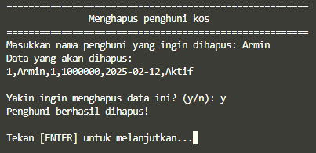

Data penghapusan yang dikirim ke file `history_hapus.csv` akan terlihat seperti 
berikut:
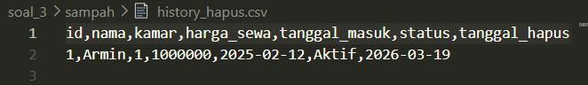

### Menu 3 - Tampilkan Daftar Penghuni
Pada menu ini, kita diminta untuk menampilkan data detail siapa saja penghuni Kost Slebew. Soal meminta kita untuk mengolah database csv yang mentah menjadi format tabel yang rapi. Berikut adalah kode yang diimplementasikan untuk menu ini:

```bash
tampilkan_penghuni(){
    file="data/penghuni.csv"

    if [ ! -f "$file" ]; then
        echo "File tidak ditemukan!"
        return
    fi

    if [ ! -f "$file" ] || [ $(wc -l < "$file") -le 1 ]; then
        echo "Belum ada data penghuni!"
        read -p "Tekan [ENTER] untuk melanjutkan..."
        return
    fi
    echo "============================================================================="
    echo "                       DAFTAR PENGHUNI KOST SLEBEW"
    echo "============================================================================="
    echo "ID   |         Nama         |  Kamar  |         Harga        |    Status"
    echo "-----------------------------------------------------------------------------"

    awk -F',' '
    NR>1 {
        id=$1
        nama=$2
        kamar=$3
        harga=$4
        status=$6

        # padding manual (sederhana)
        while(length(nama) < 20) nama=nama " "
        while(length(kamar) < 7) kamar=kamar " "
        while(length(harga) < 10) harga=harga " "

        print id "    | " nama " | " kamar " | " harga "           | " status

        total++
        if (status == "Aktif") aktif++
        if (status == "Menunggak") menunggak++

        if (aktif < 1) aktif = 0
        if (menunggak < 1) menunggak = 0
    }
    END {
        print "-----------------------------------------------------------------------"
        print "Total Penghuni   : " total
        print "Status Aktif     : " aktif
        print "Status Menunggak : " menunggak
    }
    ' "$file"

    echo "============================================================================="
    echo
    read -p "Tekan [ENTER] untuk melanjutkan..."
}
```

Berikut adalah tampilan ketika menu tersebut dijalankan:

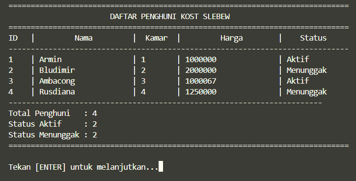

### Menu 4 - Update Status Penghuni
Pada menu ini, kita diminta untuk membuat mekanisme untuk mengubah status penghuni (Status/Menunggak). Berikut adalah implementasi kode untuk menu ini:

```bash
update_status(){
    file="data/penghuni.csv"

    if [ ! -f "$file" ]; then
        echo "File tidak ditemukan!"
        return
    fi

    if [ ! -f "$file" ] || [ $(wc -l < "$file") -le 1 ]; then
        echo "Belum ada data penghuni!"
        read -p "Tekan [ENTER] untuk melanjutkan..."
        return
    fi
    echo "==================================================="
    echo "           Memperbarui status penghuni"
    echo "==================================================="

    while true
    do
        read -p "Masukkan nama penghuni: " nama

        # cek ada atau tidak
        if ! awk -F',' -v n="$nama" 'NR>1 && $2==n {found=1} END{exit !found}' "$file"; then
            echo "Penghuni tidak ditemukan!"
            read -p "Tekan [ENTER] untuk melanjutkan..."
        else 
            break
        fi

    done

    echo "Data ditemukan:"
    awk -F',' -v n="$nama" '
    NR>1 && $2==n {
        print "ID:", $1, "| Nama:", $2, "| Status saat ini:", $6
    }' "$file"

    echo

    # input status baru
    while true; do
        read -p "Masukkan status baru (Aktif/Menunggak): " status_baru

        if [[ "$status_baru" == "Aktif" || "$status_baru" == "Menunggak" ]]; then
            break
        else
            echo "Format tidak valid!"
        fi
    done

    # update file
    awk -F',' -v n="$nama" -v s="$status_baru" '
    BEGIN { OFS="," }
    NR==1 { print; next }

    {
        if ($2 == n) {
            $6 = s
        }
        print
    }
    ' "$file" > temp.csv

    mv temp.csv "$file"

    echo "Status berhasil diperbarui!"
    read -p "Tekan [ENTER] untuk melanjutkan..."
}
```
Pertama - tama, dilakukan insialisasi file database yang akan diambil datanya nanti. Jika file tidak ada, maka akan muncul pesan error.

```bash
    file="data/penghuni.csv"

    if [ ! -f "$file" ]; then
        echo "File tidak ditemukan!"
        return
    fi
```

Setelah itu, dilakukan pengecekan apakah isi file database kosong atau tidak
```bash
    if [ ! -f "$file" ] || [ $(wc -l < "$file") -le 1 ]; then
        echo "Belum ada data penghuni!"
        read -p "Tekan [ENTER] untuk melanjutkan..."
        return
    fi
```

Jika file database sudah berisi data penghuni, maka selanjutnya program akan meminta input berupa nama user yang ingin dubah statusnya untuk dicek apakah nama tersebut ada di database atau tidak. Jika tidak ada, maka program akan meminta input lagi hingga nama yang diberikan ada pada databse.
```bash
    read -p "Masukkan nama penghuni: " nama

    if ! awk -F',' -v n="$nama" 'NR>1 && $2==n {found=1} END{exit !found}' "$file"; then
        echo "Penghuni tidak ditemukan!"
        return
    fi
```

Jika nama ditemukan, program akan menampilkan data berupa id, nama, dan statusnya saat ini. Program lalu akan meminta input berupa status baru yang ingin diberikan.

```bash
   echo "Data ditemukan:"
    awk -F',' -v n="$nama" '
    NR>1 && $2==n {
        print "ID:", $1, "| Nama:", $2, "| Status saat ini:", $6
    }' "$file"

    echo

    while true; do
        read -p "Masukkan status baru (Aktif/Menunggak): " status_baru

        if [[ "$status_baru" == "Aktif" || "$status_baru" == "Menunggak" ]]; then
            break
        else
            echo "Format tidak valid!"
        fi
    done

    awk -F',' -v n="$nama" -v s="$status_baru" '
    BEGIN { OFS="," }
    NR==1 { print; next }

    {
        if ($2 == n) {
            $6 = s
        }
        print
    }
    ' "$file" > temp.csv

    mv temp.csv "$file"
```

Berikut contoh tampilan dan input pada menu ini:

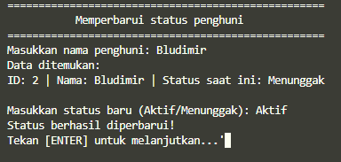

### Menu 5 - Cetak Laporan Keuangan
Pada menu ini, kita diminta untuk merekap laporan keuangan yang otomatis menghitung total penmasukan (Aktif) dan tunggakan (Menunggak). Hasil laporan tersebut nantinya akan langsung kirim ke file `laporan_bulanan.txt` pada folder `rekap`. Berikut adalah implementasi kode pada menu ini:
```bash
cetak_laporan(){
    file="data/penghuni.csv"

    if [ ! -f "$file" ]; then
        echo "File tidak ditemukan!"
        return
    fi

    if [ ! -f "$file" ] || [ $(wc -l < "$file") -le 1 ]; then
        echo "Belum ada data penghuni!"
        read -p "Tekan [ENTER] untuk melanjutkan..."
        return
    fi

    laporan="rekap/laporan_bulanan.txt"

    mkdir -p rekap

    tanggal_laporan=$(date "+%Y-%m-%d %H:%M:%S")
    {
        echo "======================================================"
        echo "               LAPORAN KEUANGAN KOST"
        echo "                ""$tanggal_laporan"
        echo "======================================================"

    awk -F',' '
    BEGIN {
        total_penghuni=0
        aktif=0
        menunggak=0
        pemasukan=0
        tunggakan=0
    }
    NR>1 {
        total_penghuni++

        if ($6 == "Aktif") {
            pemasukan += $4
            aktif++
        }

        if ($6 == "Menunggak") {
            tunggakan += $4
            menunggak++
            data_menunggak = data_menunggak $1 "|" $2 "|" $3 "|" $4 "\n"
        }
    }
    END {
        print "Total Penghuni   : " total_penghuni
        print "Kamar Terisi     : " total_penghuni
        print "Status Aktif     : " aktif
        print "Status Menunggak : " menunggak
        print "--------------------------------------"
        print "Total Pemasukan  : Rp " pemasukan
        print "Total Tunggakan  : Rp " tunggakan
        print "--------------------------------------"

        print "Daftar Penghuni Menunggak:"

        if (menunggak == 0) {
            print "(Tidak ada)"
        } else {
            split(data_menunggak, arr, "\n")
            for (i in arr) {
                if (arr[i] != "") {
                    split(arr[i], f, "|")
                    print "| " f[2] " | No Kamar : " f[3] " | Total Tunggakan : Rp " f[4] " |"
                }
            }
        }
    }
    ' "$file"

    echo "======================================================"
    } | tee -a "$laporan"
    echo
    echo "Laporan berhasil disimpan ke rekap/laporan_bulanan.txt"
    read -p "Tekan [ENTER] untuk melanjutkan..."
}
```

Sama seperti menu sebelumnya, pertama-tama dilakukan inisialisasi database yang akan digunakan serta pengecekan apakah file database kosong atau tidak.

```bash
   file="data/penghuni.csv"

    if [ ! -f "$file" ]; then
        echo "File tidak ditemukan!"
        return
    fi

    if [ ! -f "$file" ] || [ $(wc -l < "$file") -le 1 ]; then
        echo "Belum ada data penghuni!"
        read -p "Tekan [ENTER] untuk melanjutkan..."
        return
    fi
```

Selanjutnya, dilakukan inisialisasi file untuk menyimpan hasil laporan bulanan

```bash
    laporan="rekap/laporan_bulanan.txt"

    mkdir -p rekap
```
Selanjutnya, akan dibuat rekap laporan keuangan yang berisi informasi berupa tanggal perekapan, total penghuni, total kamar yang dipakai, total pendapatan, total tunggakan, dan informasi mengenai penghuni yang menungggak.
```bash
   tanggal_laporan=$(date "+%Y-%m-%d %H:%M:%S")
    {
        echo "======================================================"
        echo "               LAPORAN KEUANGAN KOST"
        echo "                ""$tanggal_laporan"
        echo "======================================================"

    awk -F',' '
    BEGIN {
        total_penghuni=0
        aktif=0
        menunggak=0
        pemasukan=0
        tunggakan=0
    }
    NR>1 {
        total_penghuni++

        if ($6 == "Aktif") {
            pemasukan += $4
            aktif++
        }

        if ($6 == "Menunggak") {
            tunggakan += $4
            menunggak++
            data_menunggak = data_menunggak $1 "|" $2 "|" $3 "|" $4 "\n"
        }
    }
    END {
        print "Total Penghuni   : " total_penghuni
        print "Kamar Terisi     : " total_penghuni
        print "Status Aktif     : " aktif
        print "Status Menunggak : " menunggak
        print "--------------------------------------"
        print "Total Pemasukan  : Rp " pemasukan
        print "Total Tunggakan  : Rp " tunggakan
        print "--------------------------------------"

        print "Daftar Penghuni Menunggak:"

        if (menunggak == 0) {
            print "(Tidak ada)"
        } else {
            split(data_menunggak, arr, "\n")
            for (i in arr) {
                if (arr[i] != "") {
                    split(arr[i], f, "|")
                    print "| " f[2] " | No Kamar : " f[3] " | Total Tunggakan : Rp " f[4] " |"
                }
            }
        }
    }
    ' "$file"
```

Berikut adalah contoh tampilan pada menu ini:

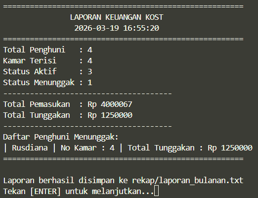

Berikut adalah contoh tampilan pada file `laporan_bulanan.txt`:

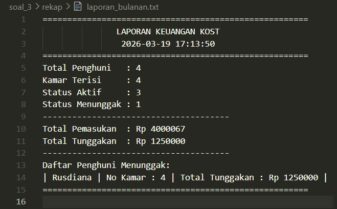

### Menu 6 - Kelola Cron
Pada menu ini, kita diminta untuk membuat fitur cron yang berfungsi untuk membantu sebagai pengingat tagihan, dengan default yakni pada pukul 7 pagi setiap harinya. Fitur yang ada pada menu ini yaitu:

1. Melihat jadwal yang aktif
2. Membuat jadwal baru
3. Menghapus jadwal yang sudah ada

Adapun beberapa catatan pada menu ini yaitu:
- Memiliki jadwal default pukul 7 pagi setiap harinya
- Hanya boleh memiliki 1 jadwal aktif pada satu waktu
- Jika mendaftarkan jadwal baru, maka jadwal pengigat yang lama otomatis akan terhapus/terganti
- Dapat memanggil script dengan argumen `--check--tagihan`` untuk mencari penghuni yang menunggak dan mencatatnya ke file `tagihan.log` pada folder `log`.

Berikut implementasi tampilan untuk menu ini:
```bash
cron_menu(){
    echo "============================================="
    echo "            MENU KELOLA CRON"
    echo "============================================="
    echo " ID | MENU"
    echo "----+----------------------------------------"
    echo " 1  | Lihat Cron Job Aktif "
    echo " 2  | Daftarkan Cron Job Pengingat"
    echo " 3  | Hapus Cron Job Pengingat "
    echo " 4  | Kembali "
    echo "=============================================" 
}

cron_dashboard(){
    while true; do 
    clear
    cron_menu
    read -p "Masukkan opsi [1-4]: " choice
    case $choice in
    1) 
        clear
        lihat_cron
        ;;
    2) 
        clear
        tambah_cron
        ;;
    3)
        clear
        hapus_cron
        ;;
    4)  
        clear
        break
        ;;
    *)
        echo "Opsi tidak valid! Silakan masukkan angka [1-4]"
        read -p "Tekan [ENTER] untuk melanjutkan..."
        ;;
    esac
done
}
```

Berikut adalah tampilan pada menu kelola cron:

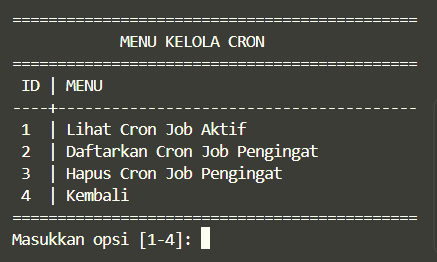

Pertama - tama dilakukan insialisasi untuk sistem pengecekan penghuni yang menunggak. Hasil cek akan masuk ke dalam file `tagihan.log` pada folder `log`.
```bash
check_tagihan(){
    file="data/penghuni.csv"
    log="log/tagihan.log"

    mkdir -p log

    tanggal=$(date "+%Y-%m-%d %H:%M:%S")

    {
        echo "=================================================="
        echo "CEK TAGIHAN - $tanggal"
        echo "=================================================="

        if [ ! -f "$file" ] || [ $(wc -l < "$file") -le 1 ]; then
            echo "(Belum ada data penghuni)"
            echo
            return
        fi

        awk -F',' '
        BEGIN {
            found=0
            total=0
        }
        NR>1 {
            if ($6=="Menunggak") {
                print "| " $2 " | KAMAR " $3 " | TUNGGAKAN: Rp " $4 " |"
                total++
                found=1
            }
        }
        END {
            if (found==0) {
                print "(Tidak ada penghuni menunggak)"
            } else {
                print "------------------------------------------"
                print "Total Menunggak : " total " penghuni"
            }
        }
        ' "$file"

        echo
    } >> "$log"
    echo "Data tagihan sudah disimpan di file tagihan.log "
}

if [ "$1" == "--check--tagihan" ]; then
    check_tagihan
    exit
fi

```
Kode di atas akan memeriksa argumen ketika kode dijalankan. Apabila argumennya adalah `--check--tagihan` maka fungsi `check_tagihan` akan dijalankan. 

Selanjutnya, dilakukan inisialisasi fungsi untuk membuat jadwal default yakni pukul 7 pagi setiap harinya. Fungsi ini nantinya akan dijalankan di awal program utama.

```bash
cron_default(){
    script_path="$(realpath "$0")"

    if ! crontab -l 2>/dev/null | grep -q -- "--check--tagihan"; then
        
        (crontab -l 2>/dev/null; echo "0 7 * * * $script_path --check--tagihan") | crontab -

    fi
}
```
- Melihat jadwal aktif

```bash
lihat_cron(){
    echo "============================================="
    echo "     --- Cron Job Pengingat Tagihan ---"
    echo "============================================="
    
    crontab -l 2>/dev/null | grep -- "--check--tagihan"

    if [ $? -ne 0 ]; then
        echo "(Tidak ada jadwal aktif)"
    fi

    echo
    read -p "Tekan [ENTER] untuk melanjutkan..."
}
```

Berikut adalah tampilan ketika menu `Lihat Cron Job Aktif` digunakan:

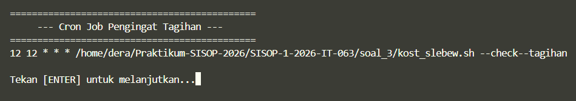

- Membuat jadwal baru
```bash
tambah_cron(){
    script_path="$(realpath "$0")"

    echo "============================================="
    echo "     --- Menambahkan Jadwal Baru ---"
    echo "============================================="

    while true; do
        read -p "Masukkan jam (0-23): " jam

        if ! [[ "$jam" =~ ^[0-9]+$ ]]; then
            echo "Jam harus angka!"
            continue
        fi

        if [ "$jam" -lt 0 ] || [ "$jam" -gt 23 ]; then
            echo "Jam harus antara 0-23!"
        else
            break
        fi
    done

    while true; do
        read -p "Masukkan menit (0-59): " menit

        if ! [[ "$menit" =~ ^[0-9]+$ ]]; then
            echo "Menit harus angka!"
            continue
        fi

        if [ "$menit" -lt 0 ] || [ "$menit" -gt 59 ]; then
            echo "Menit harus antara 0-59!"
        else
            break
        fi
    done

    echo
    echo "Jadwal yang dipilih: $jam:$menit"

    read -p "Yakin ingin menyimpan? (y/n): " confirm
    if [[ "$confirm" != "y" && "$confirm" != "Y" ]]; then
        echo "Dibatalkan."
        read -p "Tekan [ENTER] untuk melanjutkan..."
        return
    fi

    (crontab -l 2>/dev/null | grep -v -- "--check--tagihan"; echo "$menit $jam * * * $script_path --check--tagihan") | crontab -

    echo
    echo "Cron berhasil disimpan!"
    echo "Akan berjalan setiap hari pukul $jam:$menit"

    echo
    read -p "Tekan [ENTER] untuk melanjutkan..."
}
```
Di dalam fungsi ini, diterapkan validasi untuk input nilai jam dan menit sebagai berikut:

1. Jam hanya boleh dari rentang [0 - 24]
2. Menit hanya boleh dari rentang [0 - 60]

Berikut adalah tampilan dari menu  `Daftarkan Cron Job Pengingat` digunakan:

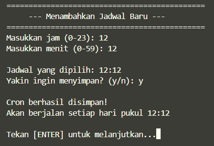

- Menghapus jadwal yang ada
```bash
hapus_cron(){
    script_path="$(realpath "$0")"

    echo "============================================="
    echo "         --- Menghapus Jadwal ---"
    echo "============================================="

    read -p "Yakin ingin menghapus? (y/n): " confirm
    if [[ "$confirm" != "y" && "$confirm" != "Y" ]]; then
        echo "Dibatalkan."
        read -p "Tekan [ENTER] untuk melanjutkan..."
        return
    fi


    crontab -l 2>/dev/null | grep -v -- "--check--tagihan" | crontab -

    echo "Jadwal berhasil dihapus."
    echo
    read -p "Tekan [ENTER] untuk melanjutkan..."
}
```
Pada menu ini, program akan menghapus jadwal yang lama dan membuat jadwal menjadi kosong.

Berikut adalah tampilan menu `Hapus Cron Job Pengingat` ketika digunakan:

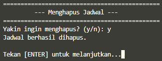

### Menu 7 - Keluar
Berikut adalah tampilan program ketika opsi untuk keluar dari menu dipilih:

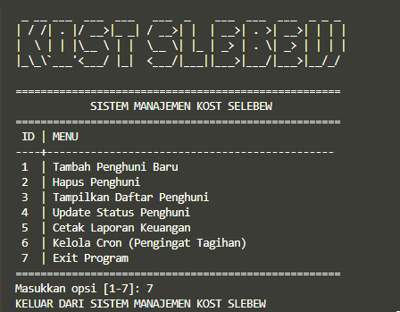